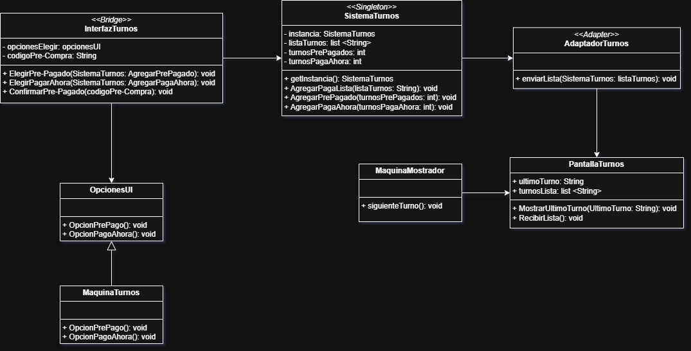
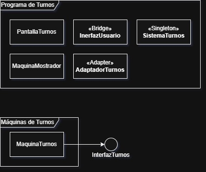

# Sistema de Gestión de Turnos Digitales

## Descripción General del Sistema

Este proyecto es el modelado de un **sistema de gestión de turnos digitales**, que se trata de poder tomar un turno en una máquina exacta, para después los encargados del lugar poder presionar un botón para atender el número que aparezca en el sistema. El sistema toma en cuenta los siguientes puntos críticos:
+ Poder tomar número
+ Confirmar pedidos prepagados
+ Mostrar el número del siguiente turno

## Objetivos del modelado

+ Crear el proceso de toma de números digitales
+ Desarrollar un sistema lógico y despliegue físico del sistema

## 1. Diagrama de Casos de Uso UML

### Descripción General:
Al analizar el problema fue permitido entender cuáles son los actores en este sistema además de cuáles son los puntos críticos en la funcionalidad de este, permitiendo identificar pasos obligatorios y opcionales en el sistema que le permitirá tener un proceso entendible y fácil de saber como funciona el sistema.

### Actores identificados:
+ Cliente: Quien viene a comprar y necesita tomar un número para ser atendido.
+ Trabajador: Quien controla quién será el siguiente en ser atendido.

### Casos de Uso Destacados y Relaciones Aplicadas:
+ Sacar número
  - `<<Extend>>` **Elegir comprar en el momento**: Al estar en la máquina uno puede elegir que está comprando para pagar ahora, poniéndolo en, por ejemplo, fila A.
  - `<<Extend>>` **Elegir ítem pre-pagado**: Al estar en la máquina uno puede elegir que está recogiendo algo que ya pago, poniéndolo en, por ejemplo, fila B.

+ Cambiar a siguiente número
  - `<<Include>>` **Notificar en pantalla el turno**: Al cambiar al siguiente turno deberá ser mostrado en una pantalla.

+ Elegir comprar en el momento
  - `<<Include>>` **Imprimir número**: Siempre se debe imprimir el turno.

+ Elegir Ítem Pre-Pagado
  - `<<Include>>` **Confirmar con código de compra**: Es obligatorio confirmar que ya tiene un ítem pagado.

+ **Confirmar con código de compra**
  - `<<Include>>` **Imprimir número**: Siempre se debe imprimir el turno.
 
### Justificación de las relaciones aplicadas:

+ La utilización de `<<Include>>` fue en todos los casos que un proceso es completamente obligatorio y debe pasar, como el **Elegir comprar en el momento** y **Confirmar con código de compra** que es un proceso que siempre debe generar un número.
+ La utilización de `<<Extend>>` fue usado en partes del proceso las cuales se pueden elegir diversas opciones, en el caso de **sacar número** donde se podían elegir dos.
+ Los flujos se hicieron lo más claro posible como se me fue pedido en este trabajo.

### Relación destacada:
No veo ninguna relación, la que haya que destacar sobre otras.

## 2. Diagrama de Clases UML con Patrones Aplicados

### Justificación Arquitectónica y Patrones Aplicados

### Selección de Patrones
La selección de los patrones fue para el cumplimiento del sistema pedido, para que funcione de la forma más eficaz y fácil posible, evitando posibles fallos que puedan pasar a futuro:

+ ### Singleton (`SistemaTurnos`)

#### Justificación:
Se eligió **singleton** para la gestión de los parámetros más utilizada y critico en un sistema de turnos digitales, los parámetros de los turnos, además de una lista de todos los turnos para tenerlos de la forma más ordenada posible y por como fueron tomados. Este patrón permite que solo haya una *única existencia global* para evitar errores de multiplicación o inconsistencia posibles que pueda haber, para que solo existencia una única forma accesible de modificar los turnos que hay.

**Intención arquitectónica**:
+ Centralizar la modificación de parámetros claves.
+ Evitar errores de errónea modificación.
+ Evitar posibles inconsistencias de los parámetros.

+ ### Adapter (`AdaptadorTurnos`)

#### Justificación:
El **adapter** fue usado debido a posibles diferentes aparatos para visualizar los turnos siguientes y los posibles diferentes sistemas que se quieran usar para mostrar esta información. Evitando así posibles errores en el futuro que pueda generar al necesitar una forma diferente de mostrar esta información.

**Intención arquitectónica**:
+ Evitar problemas en caso de uso de diferentes aparatos para mostrar información.

+ ### Bridge (`InterfazTurnos` + `MaquinaTurnos`)

#### Justificación:
Pensando que puede haber más de un tipo de máquina para sacar el turno de uno, debido a la expansión de los negocios que usen esta, se aplicó esto, ya que servirá para evitar posibles errores del uso de máquinas más desactualizadas y con posibles diferentes formas de enviar la información al sistema principal, el uso de Bridge hará que no afecte la lógica del sistema y funcione sin ningún problema.

**Intención arquitectónica**:
+ Flexibilidad al posible uso de diferentes sistemas.
+ Independencia entre interfaz y lógica.

## 3. Diagrama de Implementación UML

### Despliegue Físico y Decisiones técnicas:
+ Separación entre máquina para turnos y el programa en sí y sus diferentes responsabilidades.
+ Nodo con el conjunto de programas para la seguridad entre estos.

## Reflexiones Finales del Modelado
El trabajo aquí presentado está para demostrar diferentes puntos:
+ Cada punto tiene su función, y fueron pensados la forma más efectiva en la que pueden trabajar.
+ El modulado de esto permitir crear un programa estable, flexible, y fácil de usar para todos.
Este trabajo está hecho para demostrar la capacidad de hacer un modulado que va a funcionar de una forma excelente, demostrando expertiz y profesionalidad.
