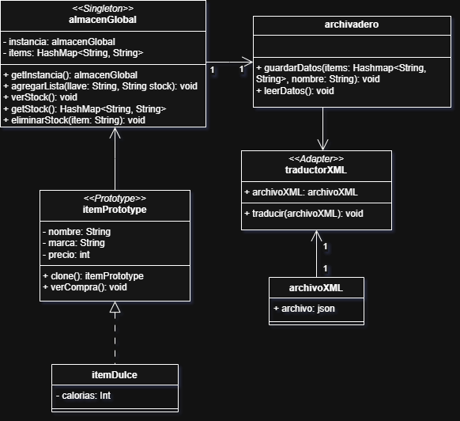
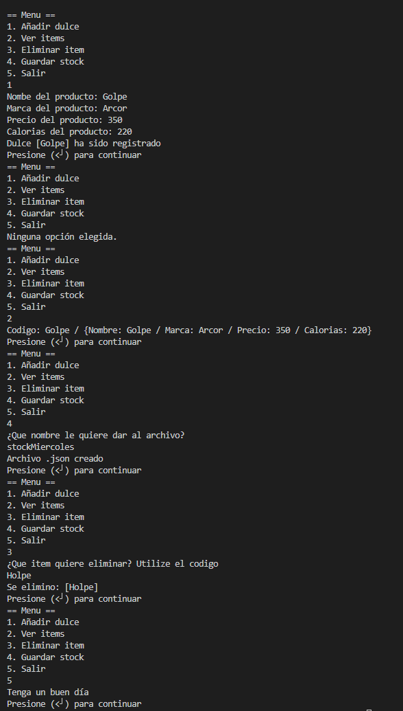

# Estudiante:

- Milovan Veroisa - Patrones de Diseño (Sección 2)

## La app y los problemas a resolver

Esta pequeña app para almacenes y negocios sirve para poder administrar el stock de un almacén, permitiéndole añadir stock, remover stock, ver el stock, poder guardarlos en un archivo `.json` además de poder leerlos de un archivo `.json`, y si es necesario traducir un `.xml` para que sea `.json`, usable para la aplicación. Todo esto para resolver y actualizar la administración de productos de estos lugares para poder usarlo en vez del papel.

## Cómo ejecutar

En cualquier carpeta que usted quiera instalar esto. De esta manera se clona, se entra a la carpeta, para después compilarlo y ejecutar el programa. Esta es la forma para solo tomar la carpeta necesaria.

```git
git clone --no-checkout https://github.com/RedKrasnoye/trabajosPatrones.git
cd trabajosPatrones
git sparse-checkout init
git sparse-checkout set almacenApp
git checkout main

cd almacenApp/src

javac App.java
java App.java
```

## Las carpetas y archivos

Las carpetas y archivos incluidos en este trabajo son los siguientes:

* trabajosPatrones
  - almacenApp
    - img
    - lib
      - gson-2.13.1.jar
    - src
      - almacenGlobal.java
      - App.java
      - archivadero.java
      - itemDulce.java
      - itemPrototype.java
    - README.md

Esto no incluye el .Class a sí que solo funcionará si se hace lo de [arriba](#como-ejecutar).

## Diagrama UML

He decidido hacer el `Diagrama de Clases` para poder hacer mejor el programa y de forma más ordenada. Puede ver el diagrama aquí:



Esto es la mejor idea que tuve para un pequeño proyecto que puedo hacer base a mis entendimientos. Para sus explicaciónes del por qué, cómo y dónde, vea [la siguiente parte](#patrónes-y-su-explicación).

## Patrones y su explicación

### Singleton

El archivo `almacenGlobal.java` implementa `Singleton` lo cual le permite ser único. Esto se eligió para tener una sola una lista, la cual no tomar una versión errónea por accidente, y tener acceso centralizado al `HashMap` que tiene sin ninguna inconsistencia. Si quiere ver cómo se hizo, se puede ver en `almacenGlobal.java` en los siguientes fragmentos.

Atributos únicos:

```java
private static almacenGlobal instancia;
private HashMap<String, String> items = new HashMap<>();
```

Fragmento:

```java
public static almacenGlobal getInstancia() {
    if (instancia == null) {
        instancia = new almacenGlobal();
    }
    return instancia;
}
```

Además de tener las siguientes funciones:

```java
public void agregarLista (String llave, String stock) {
    items.put(llave, stock);
}

public void verStock(){
    for(String i: items.keySet()) {
        System.out.println("Codigo: "+i+" / "+items.get(i));
    }
}

public HashMap<String, String> getStock(){
    return items;
}

public void eliminarStock(String stock) {
    System.out.println("Se elimino: ["+stock+"]");
    items.remove(stock);
}
```

Pero si se pregunta cómo se usa, podrá observar que se usa de la siguiente manera en `App.java` para dar uso a sus muy buenas funciones.
Llamado al `Singleton` de esta manera para usarlo en un futuro de una manera más sencilla:

```java
almacenGlobal almacen = almacenGlobal.getInstancia();
```

Y usándose en los siguientes fragmentos.
Para poder añadir un nuevo ítem a su `HashMap`:

```java
System.out.println(MessageFormat.format("Dulce [{0}] ha sido registrado", stockCopia.getNombre()));
String dulce = "{Nombre: "+stockCopia.getNombre()+" / Marca: "+stockCopia.getMarca()+" / Precio: "+stockCopia.getPrecio()+" / Calorias: "+stockCopia.getCalorias()+"}";
almacen.agregarLista(stockCopia.getNombre(), dulce);
```

Simplemente, ver que tiene su `HashMap`:

```java
case "2":
    almacen.verStock();
```

Elimnar algo de su `HashMap`:

```java
System.out.println("¿Que item quiere eliminar? Utilize el codigo");
String eliminarStock = scanner.nextLine();
almacen.eliminarStock(eliminarStock);
```

Tomar y usar el mismo `HashMap`:

```java
System.out.println("¿Que nombre le quiere dar al archivo?");
String nombreJson = scanner.nextLine();
archivar.guardarDatos(almacen.getStock(), nombreJson);
```

### Prototype

El archivo `itemPrototype.java` implementa el patrón `Prototype`, esto se hizo debido a las optimizaciones que da al no tener que crear el mismo objeto de la nada una y otra vez, permitiéndole hacerlo de una forma más rápida, además de poder expandir diferentes clases que necesites los mismos parámetros base, que por ahora es solo uno. Se puede ver cómo se hizo en `itemProrotype.java` de la siguiente manera:

```java
@Override
public itemPrototype clone() {
    try {
        return (itemPrototype)super.clone();
    } catch (CloneNotSupportedException e) {
        e.printStackTrace();;
    }
    return null;
}
```

Lo cual le permite ser copiado sin ningún tipo de problemas.
Además, itemPrototype tiene los siguientes parámetros:

```java
private String nombre;
private String marca;
private int precio;
```

Y es usado en la clase `itemDulce` para poder usar los parámetros base y se usa de la siguiente forma:
```java
public class itemDulce extends itemPrototype {
    private int calorias;

    public itemDulce(String nombre, String marca, int precio, int calorias) {
        super(nombre, marca, precio);
        this.calorias = calorias;
    }
```

Esto es para ser usado de la siguiente manera en `App.java`:

```java
itemDulce stockDulce = new itemDulce(nombreItem, marcaItem, precioProducto, caloriasProducto);
itemDulce stockCopia = (itemDulce)stockDulce.clone();
System.out.println(MessageFormat.format("Dulce [{0}] ha sido registrado", stockCopia.getNombre()));
String dulce = "{Nombre: "+stockCopia.getNombre()+" / Marca: "+stockCopia.getMarca()+" / Precio: "+stockCopia.getPrecio()+" / Calorias: "+stockCopia.getCalorias()+"}";
almacen.agregarLista(stockCopia.getNombre(), dulce);
```

### Adapter

Su uso, en un archivo que iba a ser llamado `traductorXML.java`, iba a ser para traducir archivos tipo `XML` a archivos `JSON` para poder ser cargados y utilizados por el `HashMap` de `almacenGlobal.java`, al final no se pudo hacer por falta de tiempo y conocimiento.

## Menú de la consola

Lo siguiente es lo que se puede ver al ejecutar `App.java` en la consola, esto para que pueda elegir las diferentes opciones que se le da.

```
== Menu ==      
1. Añadir dulce 
2. Ver items    
3. Eliminar item
4. Guardar stock
5. Salir        
█
```

## El sistema

Se puede ver acá una screenshot de la `App` siendo usado en la aplicación `Visual Studio Code`.
La limpieza automática de la terminal fue desactivada para mostrar su funcionamiento.



Aquí pasado a texto.

```
== Menu ==
1. Añadir dulce 
2. Ver items    
3. Eliminar item
4. Guardar stock
5. Salir        
1
Nombe del producto: Golpe
Marca del producto: Arcor
Precio del producto: 350
Calorias del producto: 220
Dulce [Golpe] ha sido registrado
Presione (<┘) para continuar    
== Menu ==
1. Añadir dulce
2. Ver items
3. Eliminar item
4. Guardar stock
5. Salir
Ninguna opción elegida.
== Menu ==      
1. Añadir dulce 
2. Ver items    
3. Eliminar item
4. Guardar stock
5. Salir        
2
Codigo: Golpe / {Nombre: Golpe / Marca: Arcor / Precio: 350 / Calorias: 220}
Presione (<┘) para continuar
== Menu ==
1. Añadir dulce
2. Ver items
3. Eliminar item
4. Guardar stock
5. Salir
4
¿Que nombre le quiere dar al archivo?
stockMiercoles
Archivo .json creado
Presione (<┘) para continuar
== Menu ==
1. Añadir dulce
2. Ver items
3. Eliminar item
4. Guardar stock
5. Salir
3
¿Que item quiere eliminar? Utilize el codigo
Holpe
Se elimino: [Holpe]
Presione (<┘) para continuar
== Menu ==
1. Añadir dulce
2. Ver items
3. Eliminar item
4. Guardar stock
5. Salir
5
Tenga un buen día
Presione (<┘) para continuar
```
