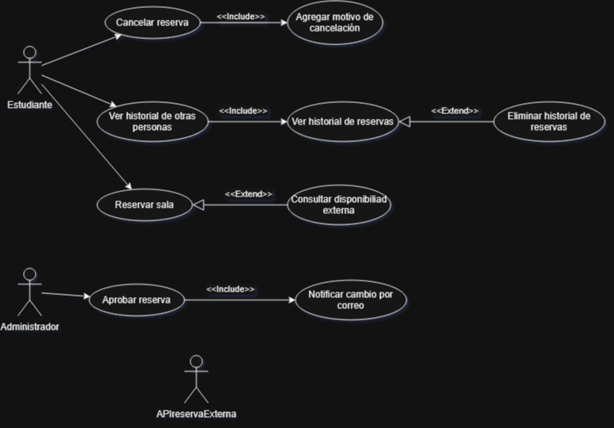
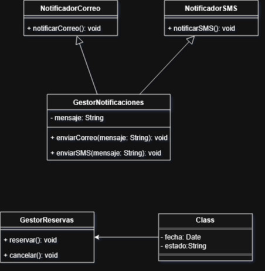
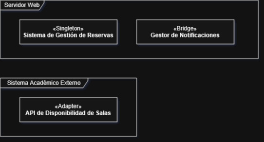

# Simulación de Médico de Software
## Estudiante:

+ Nombre Completo: Milovan Veroisa González
+ Sección: 2

## Caso de Uso
### Errores y Soluciones:
+ Cancelar reserva -> Agregar motivo de cancelación
  
**Error**: Le falta tener el texto de `<<include>>` lo cual está mal debido a que hay que clarificar.
  
**Solución**: Incluir `<<include>>` entre sus conexiones.

+ Ver historial de otras personas -> Ver historial de reservas

**Error**: Le falta tener el texto de `<<include>>` lo cual está mal debido a que hay que clarificar.
  
**Solución**: Incluir `<<include>>` entre sus conexiones.

+ Ver historial de reservas -> Eliminar historial de reservas

**Error**: Le falta tener el texto de `<<extend>>` lo cual está mal debido a que hay que clarificar.
  
**Solución**: Incluir `<<extend>>` entre sus conexiones.

+ Reservar sala -> Consultar disponibilidad externa

**Error**: Le falta tener el texto de `<<extend>>` lo cual está mal debido a que hay que clarificar.
  
**Solución**: Incluir `<<extend>>` entre sus conexiones.

+ Aprobar reserva -> Notificar cambio por correo

**Error**: Le falta tener el texto, además de que sería mejor que sea un `<<include>>` lo cual crearía problemas al ser confuso.
  
**Solución**: Incluir `<<include>>` entre sus conexiones, además de girar y cambiar la flecha.

+ Actor APIReservaExtema

**Error**: El nombre está mal escrito, además del formato podía ser mejor, podría crear confusión.
  
**Solución**: Cambiar el nombre a APIreservaExterna.

## Diagrama de Clases
### Errores y Soluciones:
+ Clase `Reserva`

**Error**: No esta conectado a nada.

**Solución**: Conectarlo a `SistemaReservas`.

+ Clase `NotificadorCorreo` y `NotificadorSMS`

**Error**: Tiene el mismo nombre `notificar()` para su función, lo cual puede causar confusión.

**Solución**: Cambiar las funciones a `notificarCorreo()` y `notificarSMS()` a cada clase respectivamente.

+ Clase `GestorNotificaciones`

**Error**: Tiene las funciones `enviarCorreo()` y `enviarSMS()` pero no tiene ningún parámetro que enviar.

**Solución**: Crear un parámetro `String` llamado `Mensaje` para poder enviar un mensaje.

+ Todas las clases

**Error**: Ninguna función específica si es void, int, o algún tipo, lo cual crearía diversos errores y confusión.

**Solución**: Clarificar que tipo de función es.

## Diagrama de Implementación
### Errores y Soluciones:
+ `Sistema de Gestión de Reservas`

**Error**: Se dice que es patrón `Singleton` pero no se especifica como debe, lo cual puede crear confusión.

**Solución**: Especificar que es un patrón `Singleton`.

+ `Gestor de Notificaciones`

**Error**: Se dice que es patrón `Bridge` pero no se especifica como debe, lo cual puede crear confusión.

**Solución**: Especificar que es un patrón `Bridge`.

+ `API de Disponibilidad de Salas`

**Error**: Se dice que se accede mediante patrón `Adapter` pero no se especifica como, debe lo cual puede crear confusión.

**Solución**: Especificar que es un patrón `Adapter`.

